# ⚡ SwiftBackupPrem

<p align="center">
  <b>An advanced Xposed / LSPosed module for <a href="https://play.google.com/store/apps/details?id=org.swiftapps.swiftbackup">Swift Backup</a> that unlocks Premium features and enables isolated, custom Firebase backend integration.</b>
</p>

<p align="center">
  <a href="https://github.com/s1ddhants1/SwiftBackupPrem/releases"></a>
  <a href="https://t.me/SwiftBackupPrem"></a>
  <a href="https://github.com/s1ddhants1/SwiftBackupPrem/blob/main/LICENSE"></a>
  
  
  
</p>

---

## 📖 Table of Contents

- [✨ Features](#-features)
- [📱 Compatibility & Prerequisites](#-compatibility--prerequisites)
- [🚀 Installation & Activation](#-installation--activation)
- [🔥 Custom Firebase Setup Guide](#-custom-firebase-setup-guide)
  - [Why Use Your Own Firebase Instance?](#why-use-your-own-firebase-instance)
  - [Step 1: Create a Firebase Project](#step-1-create-a-firebase-project)
  - [Step 2: Set Up Realtime Database & Security Rules](#step-2-set-up-realtime-database--security-rules)
  - [Step 3: Configure Authentication](#step-3-configure-authentication)
  - [Step 4: Register Android App & OAuth Client](#step-4-register-android-app--oauth-client)
  - [Step 5: Enable Google Drive API & OAuth Scopes](#step-5-enable-google-drive-api--oauth-scopes)
  - [Step 6: Import or Enter Credentials in SwiftBackupPrem](#step-6-import-or-enter-credentials-in-swiftbackupprem)
- [🔓 Guide: Migrating & Accessing Backups from Default Firebase](#-guide-migrating--accessing-backups-from-default-firebase)
- [⚡ Automated 1-Click Backup Rebuilder & Restorer](#-automated-1-click-backup-rebuilder--restorer)
- [🔄 Configuration Export & Migration](#-configuration-export--migration)
- [🛠️ Building from Source](#️-building-from-source)
- [💬 Community & Support](#-community--support)
- [❓ Frequently Asked Questions (FAQ)](#-frequently-asked-questions-faq)
- [🤝 Credits & Acknowledgements](#-credits--acknowledgements)
- [⚖️ License & Disclaimer](#️-license--disclaimer)

---

## ✨ Features

- 🔓 **Premium Toggle & Unlocking**: Enables all Swift Backup Premium functionality on-demand without needing Google Play Store licensing, with active runtime state enforcement.
- 🚫 **Disable Telemetry & Tracking**: Selectively blocks Firebase Analytics, Crashlytics, Sessions, Installations, and Google DataTransport tracking calls for maximum privacy.
- 🛡️ **Custom Firebase Backend (Anti-Ban & Privacy)**: Directs Swift Backup to use your personal Firebase instance for user authentication and cloud synchronization metadata, eliminating reliance on the developer's shared backend.
- ☁️ **Google Drive Full Access & Cloud Restore**: Upgrades Google Drive OAuth scopes to discover backups across accounts, automatically fetches & decodes cloud `.extra` metadata, and indexes cloud backups without relying on original Firebase catalog state.
- ⚡ **Dynamic DexKit Bytecode Scanning**: Utilizes [DexKit](https://github.com/LuckyPray/DexKit) to dynamically locate obfuscated classes and methods at runtime across versions, ensuring robust compatibility with newer app updates.
- 🎨 **Modern Material 3 UI**: Clean user interface built with Jetpack Compose, edge-to-edge display, dynamic theme adaptation, and responsive layouts.
- 🧙 **Interactive 5-Step Guided Wizard**: In-app wizard with 1-click clipboard helpers (package name, SHA-1 signing fingerprint) and direct links to Firebase and Google Cloud consoles.
- 📥 **One-Tap JSON Import**: Automatically parses and fills credentials directly from standard `google-services.json` files.
- 💾 **Configuration Export & Import**: Easily backup or migrate your custom Firebase setup across devices using `sbp_config.json`.
- ⚡ **Quick Process Controls**: One-tap Root Force Stop and Launch shortcuts directly inside the app.

---

## 📱 Compatibility & Prerequisites

| Requirement             | Details                                                                                                               |
| :---------------------- | :-------------------------------------------------------------------------------------------------------------------- |
| **Root Solution**       | Magisk, KernelSU, or APatch                                                                                           |
| **Xposed Framework**    | [LSPosed](https://github.com/LSPosed/LSPosed) (Zygisk / Riru) v1.9.0+ or compatible framework                         |
| **Android Version**     | Android 8.1 (Oreo MR1 / API 27) up to Android 15 / 16 (API 37+)                                                       |
| **Target Application**  | [Swift Backup](https://play.google.com/store/apps/details?id=org.swiftapps.swiftbackup) (`org.swiftapps.swiftbackup`) |
| **Tested App Versions** | v4.2.3, v4.2.5, v5.0.4, v5.1.0, and newer releases                                                                    |

---

## 🚀 Installation & Activation

### Method 1: Obtainium (Recommended)

Automatically download and receive updates by adding SwiftBackupPrem to [Obtainium](https://github.com/ImranR98/Obtainium):

<p>
  <a href="https://apps.obtainium.imranr.dev/redirect?r=obtainium://add/https%3A%2F%2Fgithub.com%2Fs1ddhants1%2FSwiftBackupPrem">
    
  </a>
</p>

Or add the repository URL manually in Obtainium:

```
https://github.com/s1ddhants1/SwiftBackupPrem
```

### Method 2: Manual Download

1. **Download**: Grab the latest APK from the [Releases](https://github.com/s1ddhants1/SwiftBackupPrem/releases) page.
2. **Install**: Install the APK on your rooted Android device.

---

### Module Activation (LSPosed)

1. Open **LSPosed Manager**.
2. Navigate to the **Modules** tab and tap **SwiftBackupPrem**.
3. Toggle **Enable module**.
4. Ensure the scope includes **Swift Backup** (`org.swiftapps.swiftbackup`).
5. Perform a quick reboot (or soft reboot) of your device.
6. Open the **SwiftBackupPrem** app to configure custom Firebase credentials (recommended) or launch Swift Backup directly.

---

## 🔥 Custom Firebase Setup Guide

### Why Use Your Own Firebase Instance?

By default, Swift Backup authenticates against the app developer's Firebase project. If the developer blocks or bans your account on their Firebase instance, cloud authentication and cloud sync in Swift Backup will stop working.

Connecting your own personal Firebase project gives you complete isolation, ensures data privacy, and prevents remote bans.

---

### Step 1: Create a Firebase Project

1. Go to the [Firebase Console](https://console.firebase.google.com/).
2. Click **Add project** (or **Create a project**).
3. Enter a project name (e.g., `SwiftBackup-Personal`) and continue.
4. Google Analytics can be disabled (optional) to speed up creation.
5. Click **Create project** and wait for provisioning to finish.

<details>
<summary>📸 <b>View Step 1 Screenshots</b></summary>
<br>

<p align="center">
  <br>
  <em>1. Enter project name</em><br><br>
  <br>
  <em>2. Confirm project name</em><br><br>
  <br>
  <em>3. Configure Analytics and click Create project</em><br><br>
  <br>
  <em>4. Provisioning Firebase project</em><br><br>
  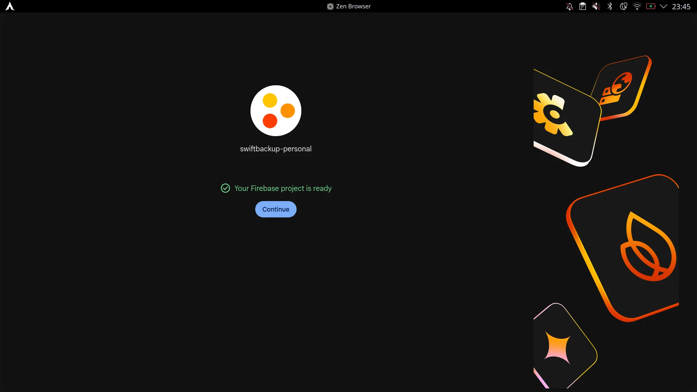<br>
  <em>5. Project is ready</em>
</p>
</details>

---

### Step 2: Set Up Realtime Database & Security Rules

1. In your Firebase project sidebar, go to **Databases & Storage > Realtime Database**.
2. Click **Create Database**, select a region close to you (e.g., `United States` or `Belgium`), and choose **Start in locked mode**.
3. Once created, switch to the **Rules** tab at the top.
4. Replace the existing rules with the following user-isolated security rules:

```json
{
  "rules": {
    "users": {
      "$uid": {
        ".read": "$uid === auth.uid",
        ".write": "$uid === auth.uid"
      }
    }
  }
}
```

5. Click **Publish** to save the rules.
6. Copy your **Realtime Database URL** from the _Data_ tab (e.g., `https://your-project-id-default-rtdb.firebaseio.com/`).

<details>
<summary>📸 <b>View Step 2 Screenshots</b></summary>
<br>

<p align="center">
  <br>
  <em>1. Select Databases &amp; Storage &gt; Realtime Database</em><br><br>
  <br>
  <em>2. Choose database region / location</em><br><br>
  <br>
  <em>3. Select Start in locked mode and Enable</em><br><br>
  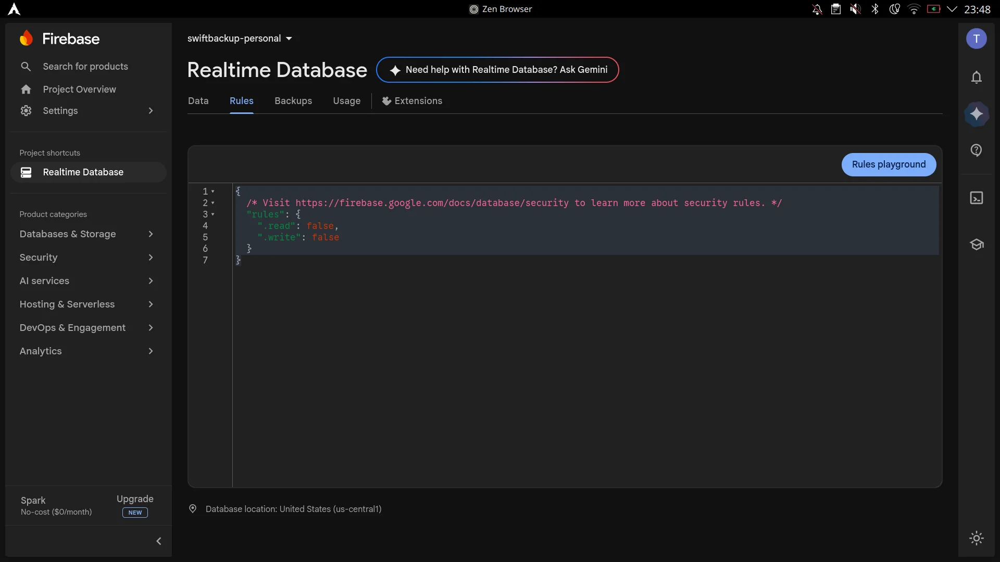<br>
  <em>4. Switch to the Rules tab</em><br><br>
  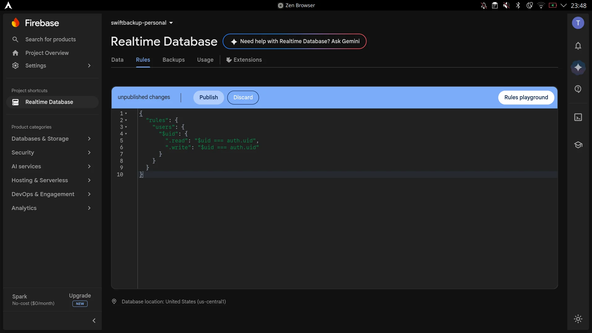<br>
  <em>5. Replace rules and click Publish</em><br><br>
  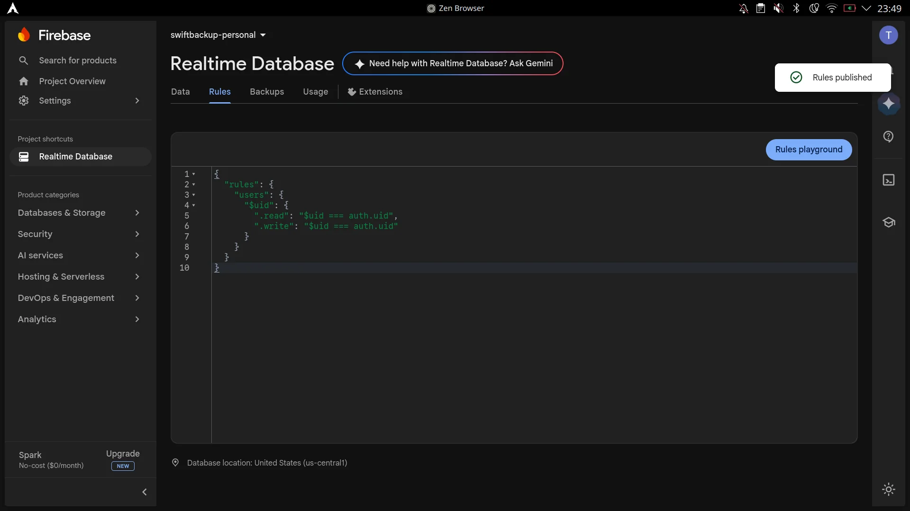<br>
  <em>6. Security rules published successfully</em><br><br>
  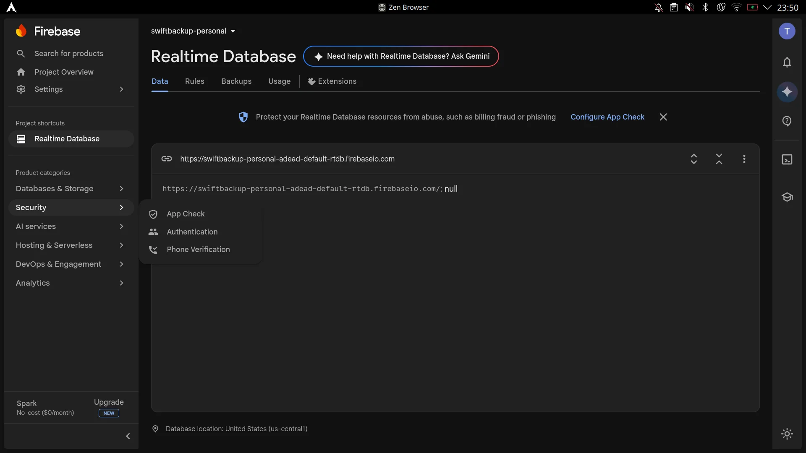<br>
  <em>7. Copy your Realtime Database URL from the Data tab</em>
</p>
</details>

---

### Step 3: Configure Authentication

1. In the Firebase sidebar, navigate to **Security > Authentication**.
2. Select the **Sign-in method** tab.
3. Under _Additional providers_, select **Google**.
4. Toggle **Enable**, enter a **Public-facing name for project** of your choice, choose a **Project support email**, and click **Save**.

<details>
<summary>📸 <b>View Step 3 Screenshots</b></summary>
<br>

<p align="center">
  <br>
  <em>1. Navigate to Authentication &gt; Sign-in method and select Google</em><br><br>
  <br>
  <em>2. Google Sign-in provider configuration dialog</em><br><br>
  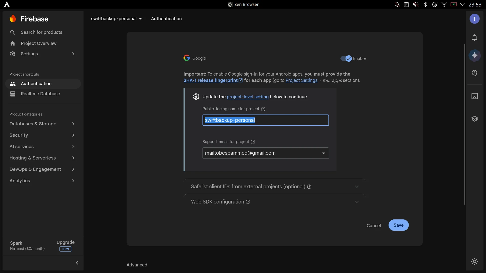<br>
  <em>3. Toggle Enable, enter public-facing name and support email, then Save</em><br><br>
  <br>
  <em>4. Google provider enabled successfully</em>
</p>
</details>

---

### Step 4: Register Android App & OAuth Client

#### 1. Register Android App in Firebase Console

1. In Firebase Console, go to the **Project Overview** page from the sidebar.
2. Under "Select a platform to get started", click the **Android** icon (Add app).
3. Enter the package details:
   - **Android package name**: `org.swiftapps.swiftbackup` _(or tap "Copy Package" in SwiftBackupPrem wizard)_
   - **App Nickname**: `SwiftBackupPersonal` _(or any name you like)_
4. Click **Register app**.
5. Click **Download google-services.json** to save the configuration file.
6. Click **Next** through the remaining setup steps (Add Firebase SDK is handled automatically by the module), then click **Continue to console**.
7. On the Project Overview page, click the newly registered app card and select the **Gear icon (Project Settings)**.
8. Scroll down to the **Your apps** section, click **Add fingerprint**, paste your **SHA-1 fingerprint** _(tap "Copy Fingerprint" in SwiftBackupPrem wizard)_, and click **Save**.
9. _(Optional)_ Click the **Data privacy** tab on Project Settings and uncheck **Firebase Service Data Sharing**.

<details>
<summary>📸 <b>View Firebase App Registration Screenshots</b></summary>
<br>

<p align="center">
  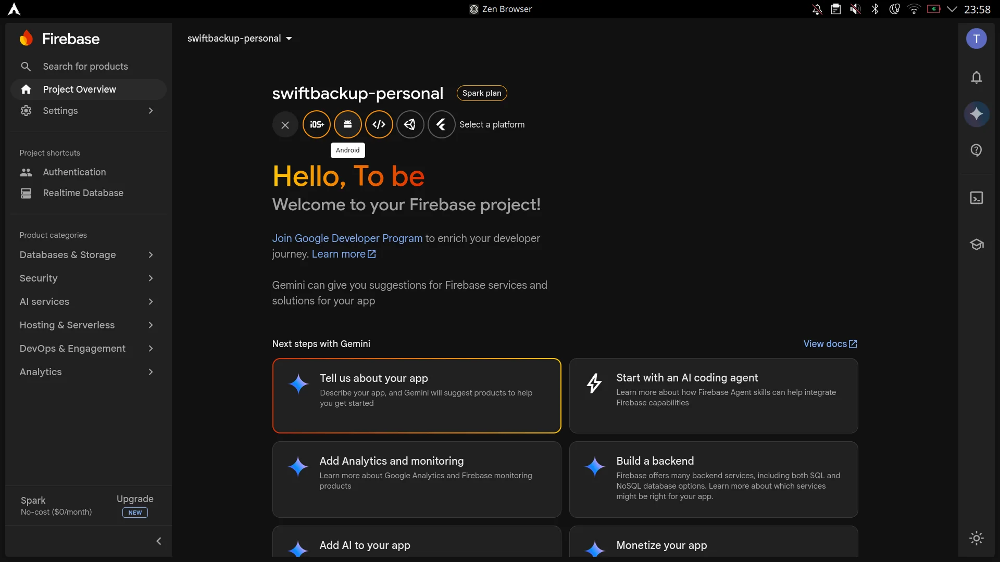<br>
  <em>1. Click the Android platform icon on Project Overview</em><br><br>
  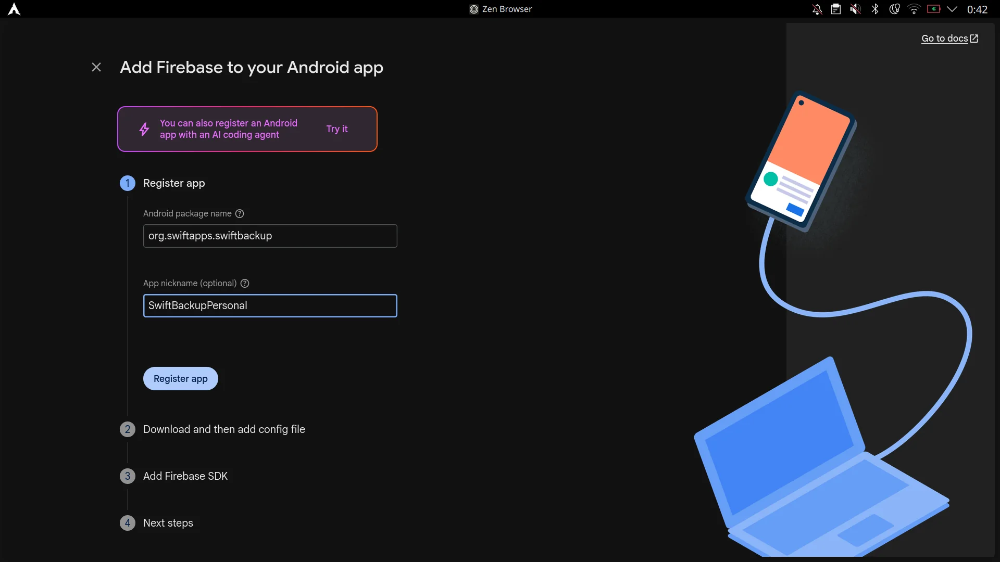<br>
  <em>2. Enter package name org.swiftapps.swiftbackup and nickname</em><br><br>
  <br>
  <em>3. Download google-services.json configuration file</em><br><br>
  <br>
  <em>4. Skip SDK setup and continue to console</em><br><br>
  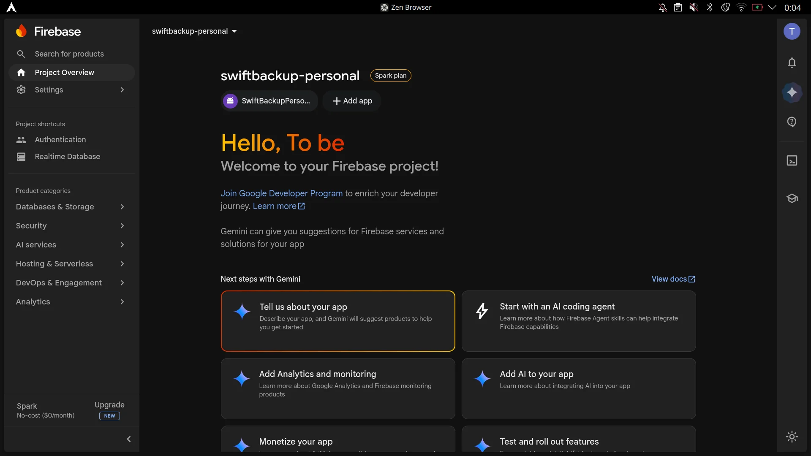<br>
  <em>5. App is registered on Project Overview</em><br><br>
  <br>
  <em>6. Click the gear icon to open Project Settings</em><br><br>
  <br>
  <em>7. Project Settings Overview (View in Google Cloud)</em><br><br>
  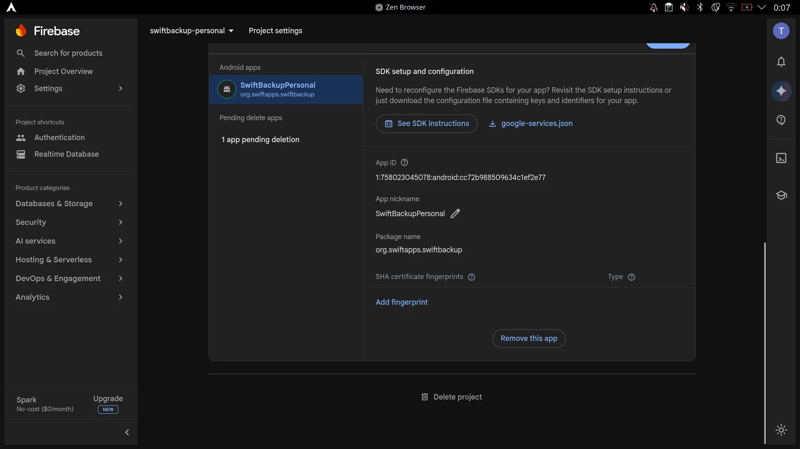<br>
  <em>8. Add SHA-1 fingerprint under Your apps</em><br><br>
  <br>
  <em>9. Optional: Disable Firebase Service Data Sharing</em>
</p>
</details>

#### 2. Configure OAuth 2.0 Client in Google Cloud Console

1. Open the [Google Cloud API Credentials Console](https://console.cloud.google.com/apis/credentials) (or click **View in Google Cloud** on the Firebase Project Settings page).
2. Ensure your Firebase / Google Cloud project is selected in the top project dropdown.
3. In the sidebar, navigate to **APIs & Services > Credentials**.
4. Under **OAuth 2.0 Client IDs**, edit the auto-generated **Android client for org.swiftapps.swiftbackup**
5. Under **Advanced settings**, check **Enable custom URI scheme** (click **Yes** in the confirmation popup).
6. Click **Save**.
7. Copy the generated **Client ID** string (e.g., `xxxxxxxxxxxx-xxxxxxxxxxxxxxxx.apps.googleusercontent.com`).
<details>
<summary>📸 <b>View Google Cloud OAuth Client Screenshots</b></summary>
<br>

<p align="center">
  <br>
  <em>1. Google Cloud Console Dashboard</em><br><br>
  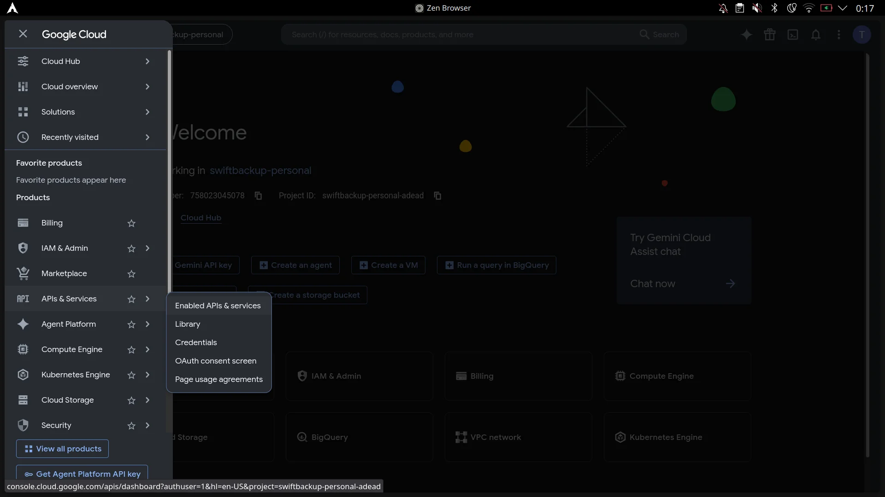<br>
  <em>2. Navigate to APIs &amp; Services &gt; Credentials</em><br><br>
  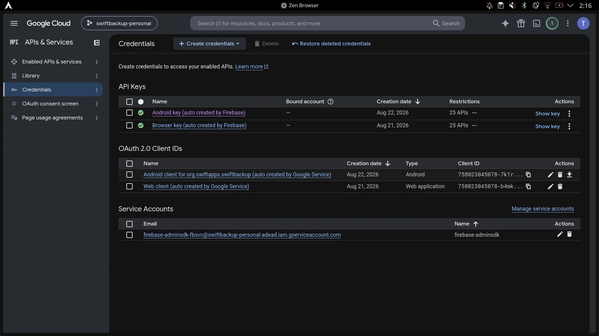<br>
  <em>3. Under OAuth 2.0 Client IDs, edit the auto-generated Android client</em><br><br>
  <br>
  <em>4. Under Advanced settings, enable Custom URI scheme</em><br><br>
  <br>
  <em>5. Copy your generated OAuth Client ID</em>
</p>
</details>

---

### Step 5: Enable Google Drive API & OAuth Scopes

If you plan to use Google Drive for cloud backups:

#### 1. Enable Google Drive API

1. Visit the [Google Cloud Drive API Console](https://console.cloud.google.com/apis/library/drive.googleapis.com).
2. Select your Firebase / Google Cloud project at the top.
3. Click **Enable** to allow Swift Backup to interact with Google Drive via your project.

#### 2. Add Google Drive OAuth Scope

1. Open the [Google Cloud OAuth Scopes Console](https://console.cloud.google.com/auth/scopes).
2. Ensure your project is selected at the top.
3. Navigate to **Data Access** > click **Add or remove scopes**.
4. In the filter box, search for and enable:
   ```
   https://www.googleapis.com/auth/drive.file
   ```
   _(This provides safe, per-file access for files created or opened by Swift Backup without requiring broad drive permissions)._
5. Click **Update**, then click **Save** (or **Save and continue**).

---

### Step 6: Import or Enter Credentials in SwiftBackupPrem

1. Open **SwiftBackupPrem** on your device.
2. Enable **Custom firebase app**.
3. Choose either method:
   - **Method A (Automatic)**: Tap **Import google-services.json** and pick the downloaded JSON file. Then paste your **OAuth Client ID** into the Client ID field.
   - **Method B (Manual Wizard)**: Follow the interactive 5-step guided wizard in the app to review and confirm all fields.
4. Tap **Finish & Save**.
5. Tap **Force Stop** at the bottom to kill any running Swift Backup instances, then tap **Open App**.
6. Sign in to Swift Backup with your Google account.

> [!NOTE]
> **Firebase Cloud Storage is Optional (Skip if on Spark Plan)**
>
> Firebase Cloud Storage now requires a paid **Blaze Plan** (linked Cloud Billing account). **You can safely skip enabling Cloud Storage in Firebase Console.**
> Swift Backup does **not** store your backup files (APKs, app data, call logs) inside Firebase Storage. Firebase is only used for authentication and metadata synchronization. Your actual backups are stored in your configured cloud provider (Google Drive, WebDAV, Nextcloud, SMB, etc.) or local storage.

---

## 🔓 Guide: Migrating & Accessing Backups from Default Firebase

Install Swift Backup with default Firebase and login to pull your UID from `/data/data/org.swiftapps.swiftbackup/shared_prefs/com.google.firebase.auth.api.Store.*.xml`:

```bash
su -c 'grep -o "GET_TOKEN_RESPONSE\.[^\"]*" /data/data/org.swiftapps.swiftbackup/shared_prefs/com.google.firebase.auth.api.Store.*.xml | cut -d. -f2'
```

### Verify UID with Backups

Swift Backup takes the MD5 hash of your Firebase UID and uses the first 16 characters for the folder name:

```bash
echo -n "example uid" | md5sum | cut -c 1-16
```

**Output**: `example16char` -> `/sdcard/SwiftBackup/accounts/example16char/`  
or in case of cloud folder: `Swift Backup (example16char)`

---

### Create the User with this UID in your Custom Firebase Project

1. Install Firebase tools using your preferred package manager (e.g., via Node.js):

   ```bash
   npm install -g firebase-tools
   ```

2. Run `firebase login` to connect your account:

   ```bash
   firebase login
   ```

3. Create a `users.json` file:

   ```json
   {
     "users": [
       {
         "localId": "example uid",
         "email": "examplemail@gmail.com",
         "emailVerified": true,
         "displayName": "examplename"
       }
     ]
   }
   ```

4. View your Project ID

   ```bash
   firebase projects:list
   ```

5. Run the import command:

   ```bash
   firebase auth:import users.json --project exampleprojectID
   ```

6. Re-login in Swift Backup.

---

## ⚡ Automated 1-Click Backup Rebuilder & Restorer

When the **Google Drive Full Access & Cloud Restore** toggle is turned on in SwiftBackupPrem, the module enables automated cloud backup restoration:

1. **Direct In-App Cloud Restore**: Discovers all backups directly from your Google Drive folder, downloads & decodes `.extra` metadata, and indexes them in real-time across the app (Single App Details, Cloud Sync tab, and Batch Restore).
2. **Local Cloud Backup Rebuilder**: When cloud backup files (`.app`, `.dat`, `.splits`, `.extdat`, `.extra`) are downloaded or copied to your device storage:
   - Swift Backup typically requires a `<packageName>.xml` metadata file which is absent in raw cloud files.
   - The module automatically detects missing metadata, decrypts the `.extra` payload on the fly using your active Firebase UID key (Conceal AES-GCM-256 + Zstandard), and generates the authentic `<packageName>.xml`.
   - The backups immediately appear with all components (APK, App Data, External Data, Splits) and are 100% restorable.

> [!WARNING]
> **Scope Disclaimer & Security Notice**:
>
> - Standard Swift Backup operates under the safe, per-file `https://www.googleapis.com/auth/drive.file` scope configured in [Step 5](#step-5-enable-google-drive-api--oauth-scopes).
> - Enabling **Google Drive Full Access & Cloud Restore** dynamically expands the runtime OAuth scope to `https://www.googleapis.com/auth/drive` (Full Drive Access) in order to query, discover, and index backups created across different devices, past Firebase projects, or manual cloud transfers.
> - Because `.../auth/drive` is classified as a sensitive scope by Google, Google may display a standard _"Google hasn't verified this app"_ warning during initial sign-in. This is expected for personal developer projects—click **Advanced > Go to Swift Backup (unsafe)** to proceed safely.

---

## 🔄 Configuration Export & Migration

- **Export Config**: Tap the top-right menu (⋮) > **Export Config** to save your active configuration to a JSON file (`sbp_config.json`).
- **Import Config**: On a new device or fresh ROM install, tap **Import Config** to restore your settings in a single click.

---

## 🛠️ Building from Source

### Prerequisites

- JDK 17 or higher
- Android SDK with Platform 37 (`compileSdk 37`)
- Android NDK (`25.1.8937393` or higher) & CMake `3.22.1+`

### Build Steps

1. Clone the repository:

   ```bash
   git clone https://github.com/s1ddhants1/SwiftBackupPrem.git
   cd SwiftBackupPrem
   ```

2. Build debug APK:

   ```bash
   ./gradlew assembleDebug
   ```

3. Build optimized release APK:
   ```bash
   ./gradlew assembleRelease
   ```

The built APK will be located in `app/build/outputs/apk/release/app-release.apk`.

---

## 💬 Community & Support

Join the official Telegram group for discussion, support, release updates, and assistance with custom Firebase configuration:

<p align="center">
  <a href="https://t.me/SwiftBackupPrem">
    
  </a>
</p>

- 📢 **Group Link**: [https://t.me/SwiftBackupPrem](https://t.me/SwiftBackupPrem)
- ❓ **Get Help**: Ask troubleshooting questions or share setup tips.
- 📦 **Releases & APKs**: Get direct download links and release notifications directly inside Telegram.

---

## ❓ Frequently Asked Questions (FAQ)

<details>
<summary><b>Q: I see "LSPosed Module Not Enabled" in the app.</b></summary>
<p>Make sure you have enabled SwiftBackupPrem inside LSPosed Manager, added Swift Backup (<code>org.swiftapps.swiftbackup</code>) to the module scope, and rebooted your device.</p>
</details>

<details>
<summary><b>Q: Google Sign-In gives Error Code 10 / 12500.</b></summary>
<p>This indicates an OAuth mismatch or missing permission:</p>
<ol>
  <li>Verify that the <b>SHA-1 fingerprint</b> entered in Firebase Console matches your installed Swift Backup app (use the "Copy Fingerprint" button in SwiftBackupPrem).</li>
  <li>Ensure <b>Enable custom URI scheme</b> is checked in Google Cloud Console OAuth Client settings.</li>
  <li>Ensure <b>Google Drive API</b> is enabled and the <code>.../auth/drive.file</code> scope is added in Google Cloud Console if using Google Drive cloud backup.</li>
  <li>Wait 5–10 minutes after creating OAuth credentials for Google's servers to propagate changes.</li>
</ol>
</details>

<details>
<summary><b>Q: Do I need a paid Firebase Blaze plan for Cloud Storage?</b></summary>
<p>No! The free <b>Spark plan</b> is 100% sufficient. Swift Backup only utilizes Firebase for authentication and metadata. You can leave Cloud Storage unconfigured.</p>
</details>

<details>
<summary><b>Q: How does DexKit work in this module?</b></summary>
<p>Swift Backup obfuscates its classes with ProGuard/R8 across different releases. Instead of hardcoding static class names that break on every update, DexKit inspects bytecode structures dynamically at runtime to locate the required hooks automatically.</p>
</details>

---

## 🤝 Credits & Acknowledgements

- **[Juby210](https://github.com/Juby210)** — Original creator and author of SwiftBackupPrem.
- **[s1ddhants1](https://github.com/s1ddhants1)** — Maintainer, Jetpack Compose Material 3 UI overhaul, guided setup wizard, and modernizations.
- **[LuckyPray/DexKit](https://github.com/LuckyPray/DexKit)** — Powerful runtime DEX search and hooking engine.
- **[LSPosed](https://github.com/LSPosed/LSPosed)** — ART hooking framework for modern Android.

---

## ⚖️ License & Disclaimer

This project is licensed under the [MIT License](LICENSE).

**Disclaimer**: This project is intended strictly for personal, educational, and backup management purposes. Swift Backup is developed by SwiftApps. If you enjoy Swift Backup, consider supporting the official developers.
